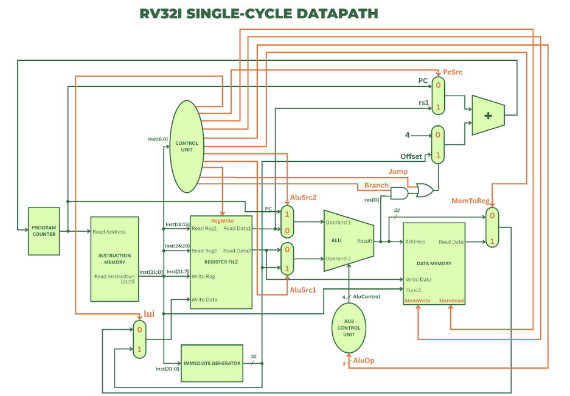

# RV32I Single-Cycle Datapath (SCDP) Processor

**Author:** Iqra Jawad  
**Hardware:** Xilinx Artix-7 FPGA (Nexys A7-100T)  
**Language:** Verilog HDL  

---

## Note
This README accompanies a **full project report** that details the **design, implementation, and verification** of the processor. Anyone reading this can refer to the report for **complete explanations, diagrams, and results**.

You can view the complete project report here:  
[RV32I SCDP Report (PDF)](RV32I_SCDP_Report.pdf)

---

## Introduction
This project implements a **single-cycle RISC-V processor** based on the **RV32I Base Integer ISA**. The processor executes each instruction in a single clock cycle and includes modules like Program Counter, Register File, ALU, Control Unit, Instruction Memory, Data Memory, and Immediate Generator.  

**Objective:** Understand computer architecture fundamentals through a fully functional 32-bit processor implemented on FPGA.  

---

## Datapath
  
*(Replace with your datapath image)*

---

## Key Modules
- **Program Counter (PC)**  
- **Instruction Memory**  
- **Register File**  
- **ALU & ALU Control**  
- **Control Unit**  
- **Data Memory**  
- **Immediate Generator**  
- **Top Module / FPGA Wrapper**  

**Parameterization:** All constants, instruction encodings, and ALU opcodes are defined in `RISCV_PKG.vh` for easy extension.  

---

## Verification
- Simulated all instructions with testbenches  
- Waveforms confirm correct ALU and memory operations  
- Results displayed on FPGA 7-segment display  

---

## Individual Contribution
- Designed **single-cycle datapath**  
- Implemented **ALU, Control Unit, Register File, Instruction Decoder**  
- Created **RISCV_PKG.vh**  
- Verified processor and deployed on FPGA  

---
